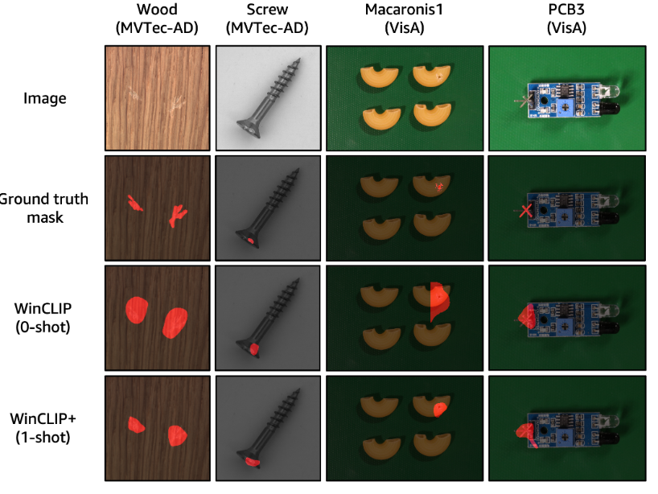

# WinCLIP: Zero-/Few-Shot Anomaly Classification and Segmentation
<p align="center"></p>
Unofficial implementation of:

WinCLIP: Zero-/Few-Shot Anomaly Classification and Segmentation, CVPR 2023 [[Paper]](https://openaccess.thecvf.com/content/CVPR2023/html/Jeong_WinCLIP_Zero-Few-Shot_Anomaly_Classification_and_Segmentation_CVPR_2023_paper.html)


## Citation
If you find the code useful, please consider citing our paper using the following BibTeX entry.
```
@InProceedings{Jeong_2023_CVPR,
    author    = {Jeong, Jongheon and Zou, Yang and Kim, Taewan and Zhang, Dongqing and Ravichandran, Avinash and Dabeer, Onkar},
    title     = {WinCLIP: Zero-/Few-Shot Anomaly Classification and Segmentation},
    booktitle = {Proceedings of the IEEE/CVF Conference on Computer Vision and Pattern Recognition (CVPR)},
    month     = {June},
    year      = {2023},
    pages     = {19606-19616}
}
```

## Related Research
```
@misc{cao2023segment,
      title={Segment Any Anomaly without Training via Hybrid Prompt Regularization}, 
      author={Yunkang Cao and Xiaohao Xu and Chen Sun and Yuqi Cheng and Zongwei Du and Liang Gao and Weiming Shen},
      year={2023},
      eprint={2305.10724},
      archivePrefix={arXiv},
      primaryClass={cs.CV}
}
```


## Prerequisite
* Python 3.7, PyTorch 1.10, and more in install.sh

#### Install python dependencies
```
sh install.sh
```


#### Download MVTec-AD dataset
* Follow instructions in https://www.mvtec.com/company/research/datasets/mvtec-ad/

#### Download MVTec-AD dataset
* Follow instructions in https://paperswithcode.com/dataset/visa

## Run run_winclip.py to reproduce the implementation results
```
python run_winclip.py
```

## Results

### MVTec-AD
| MVTec-AD   | Reported |         |          |          | Re-implementation |         |          |          |
|------------|----------|---------|----------|----------|-------------------|---------|----------|----------|
|            | i-auroc  | p-auroc | i-max-f1 | p-max-f1 | i-auroc           | p-auroc | i-max-f1 | p-max-f1 |
| carpet     | 100.00   | 95.40   | 99.40    | 49.70    | 77.41             | 88.96   | 88.44    | 29.31    |
| grid       | 98.80    | 82.20   | 98.20    | 18.60    | 48.87             | 75.08   | 85.71    | 8.40     |
| leather    | 100.00   | 96.70   | 100.00   | 39.70    | 97.35             | 97.35   | 95.70    | 29.60    |
| tile       | 100.00   | 77.60   | 99.40    | 32.60    | 79.87             | 75.87   | 85.25    | 29.30    |
| wood       | 99.40    | 93.40   | 98.30    | 51.50    | 94.74             | 93.03   | 92.68    | 44.65    |
| bottle     | 99.20    | 89.50   | 97.60    | 58.10    | 98.65             | 89.58   | 96.77    | 49.36    |
| cable      | 86.50    | 77.00   | 84.50    | 19.70    | 53.30             | 56.23   | 76.03    | 10.22    |
| capsule    | 72.90    | 86.90   | 91.40    | 21.70    | 62.03             | 88.56   | 90.46    | 9.95     |
| hazelnut   | 93.90    | 94.30   | 89.70    | 37.60    | 71.29             | 94.34   | 80.00    | 33.63    |
| metal_nut  | 97.10    | 61.00   | 96.30    | 32.40    | 37.59             | 42.67   | 89.42    | 21.67    |
| pill       | 79.10    | 80.00   | 91.60    | 17.60    | 73.10             | 74.67   | 91.56    | 11.98    |
| screw      | 83.30    | 89.60   | 87.40    | 13.50    | 64.87             | 90.09   | 85.61    | 9.09     |
| toothbrush | 87.50    | 86.90   | 87.90    | 17.10    | 41.94             | 84.02   | 84.51    | 9.26     |
| transistor | 88.00    | 74.70   | 79.50    | 30.50    | 62.25             | 67.46   | 60.87    | 15.95    |
| zipper     | 91.50    | 91.60   | 92.90    | 34.40    | 89.31             | 92.08   | 90.42    | 31.48    |
| Average    | 91.81    | 85.12   | 92.94    | 31.65    | 70.17             | 80.67   | 86.23    | 22.92    |

### VisA

| VisA       | Reported |         |          |          | Re-implementation |         |          |          |
|------------|----------|---------|----------|----------|-------------------|---------|----------|----------|
|            | i-auroc  | p-auroc | i-max-f1 | p-max-f1 | i-auroc           | p-auroc | i-max-f1 | p-max-f1 |
| candle     | 95.40    | 88.90   | 89.40    | 22.50    | 79.03             | 86.24   | 72.36    | 6.32     |
| capsules   | 85.00    | 81.60   | 83.90    | 9.20     | 53.58             | 62.00   | 77.22    | 1.36     |
| cashew     | 92.10    | 84.70   | 88.40    | 13.20    | 70.66             | 79.54   | 80.99    | 6.94     |
| chewinggum | 96.50    | 93.30   | 94.80    | 41.10    | 84.94             | 97.01   | 83.76    | 36.17    |
| fryum      | 80.30    | 88.50   | 82.70    | 22.10    | 52.60             | 86.73   | 80.33    | 15.17    |
| macaroni1  | 76.20    | 70.90   | 74.20    | 7.00     | 49.98             | 34.37   | 66.67    | 0.07     |
| macaroni2  | 63.70    | 59.30   | 69.80    | 1.00     | 49.56             | 31.49   | 66.67    | 0.06     |
| pcb1       | 73.60    | 61.20   | 71.00    | 2.40     | 55.99             | 44.04   | 68.97    | 0.97     |
| pcb2       | 51.20    | 71.60   | 67.10    | 4.70     | 61.58             | 64.47   | 69.26    | 0.70     |
| pcb3       | 73.40    | 85.30   | 71.00    | 10.30    | 51.42             | 68.71   | 66.45    | 1.06     |
| pcb4       | 79.60    | 94.40   | 74.90    | 32.00    | 78.94             | 91.86   | 74.56    | 22.75    |
| pipe_fryum | 69.70    | 75.40   | 80.70    | 12.30    | 82.80             | 93.65   | 83.48    | 22.45    |
| Average    | 78.06    | 79.59   | 78.99    | 14.82    | 64.26             | 70.01   | 74.23    | 9.50     |
